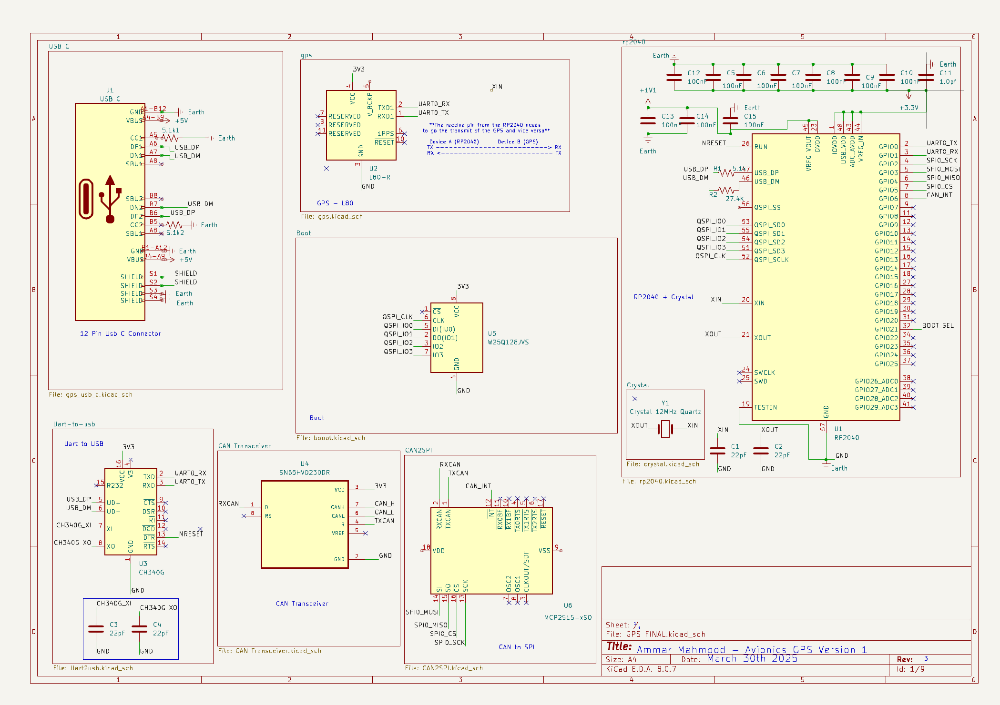
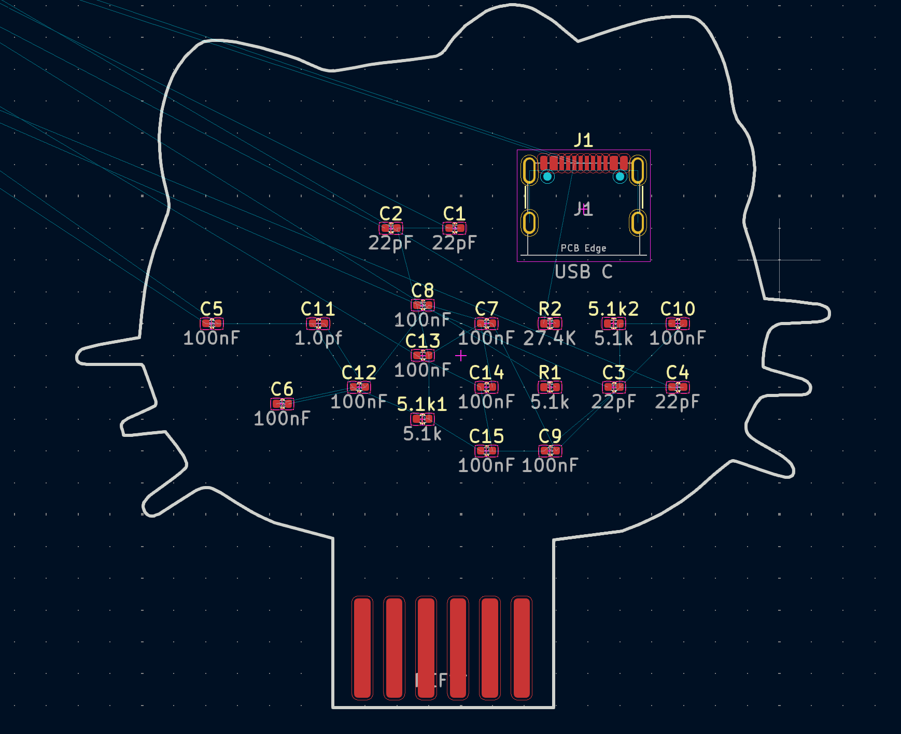

# Avionics Flight Controller - Hello Kitty PCB Outline

 

## Project Overview

This repository contains KiCad PCB designs for avionics flight controllers specifically designed for model rockets. The project aims to develop and deploy over 20 flight controller systems for rocket launches scheduled for May 2026.

Our avionics system consists of a three stack board design:

1. **GPS Board** (Currently Available)
2. **Sensor Board** (Coming Soon)
3. **Power Board** (Coming Soon)

## Current Progress

The GPS board design is now complete and ready for review. This board handles positioning data for the rocket during flight and recovery phases.

## Upcoming Work

Work is ongoing for the sensor and power boards which will complete the Hello Kitty avionics stack:

* **Sensor Board**: Will incorporate accelerometers, gyroscopes, barometers, and other sensors necessary for flight data collection
* **Power Board**: Will manage power distribution, battery management, and charging systems

## Project Timeline

* **2025 Q2**: GPS Board design and testing
* **2025 Q3**: Sensor Board design
* **2025 Q4**: Power Board design
* **2026 Q1**: Integration testing and flight preparation
* **2026 May**: Launch of 20+ rockets with Hello Kitty avionics systems

## Contributing

We welcome contributions to this project! If you have experience with PCB design, embedded systems, or rocket avionics, your input is valuable to us.

Some ways you can contribute:
* Review existing designs and suggest improvements
* Help with electrical schematics
* Assist with component selection for optimal performance
* Contribute to firmware development
* Share your experience with similar avionics systems

## Advice for Contributors

When contributing to this project, keep in mind:

* All designs should maintain compatibility with the three stack system
* Power consumption is a critical consideration
* Size and weight constraints are important for flight performance
* Robustness is essential for surviving launch conditions

## License

[Include your license information here]

## Contact

[Include your contact information here]
